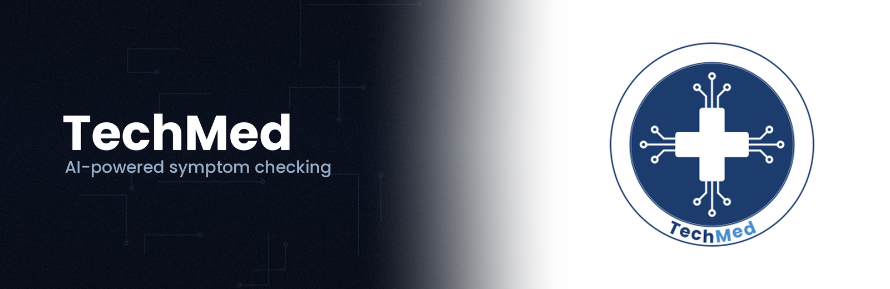

# TechMed-Website
# TechMed

# TechMed

**An accessible, AI-powered symptom checker to help patients understand their health concerns.**

[TechMed](https://github.com/Shiva-Deh/TechMed) is an accessible, AI-powered symptom-checking application that helps patients better understand their health concerns. TechMed guides users to **describe, analyze, and understand** their symptoms end-to-end, producing clear insights they can discuss with a healthcare provider.

TechMed is built for patients and caregivers who want:

- **Accessible health guidance** - check symptoms easily, anytime, anywhere
- **Clear, understandable insights** - less confusion, more actionable next steps
- **Better-informed conversations** - arrive at appointments already understanding your concerns

## Getting Started

- **Docs:** https://github.com/Shiva-Deh/TechMed/wiki
- **Repository:** https://github.com/Shiva-Deh/TechMed

## Support & Community

- **GitHub Issues:** https://github.com/Shiva-Deh/TechMed/issues
- **Email:** yutechmed@gmail.com

## Contributing

We welcome contributions - bugs, features, docs, and ideas.

- **Report bugs / request features:** https://github.com/Shiva-Deh/TechMed/issues
- **Open a pull request:** https://github.com/Shiva-Deh/TechMed/pulls

## Contact

Email: [yutechmed@gmail.com](mailto:yutechmed@gmail.com)

